# Campus Cloud Print Queue — System Architecture

## 1. Overview

### 1.1 Problem Statement

Campus printing is broken. Students walk to a printer, join a physical queue, discover the printer is jammed or out of paper, and walk to another. Jobs pile up on the wrong printer. Documents are left uncollected. Students print to a shared queue and someone else picks up their pages. There is no visibility into what is queued, no way to redirect a job, and no way to cancel without physically being at the machine.

### 1.2 Solution: Release-at-Device Printing

Campus Cloud Print Queue is a distributed, cloud-native **release-at-device** printing system. The key idea is **decoupling submission from execution**:

1. **Upload from anywhere** — Students submit print jobs from any device (laptop, phone, lab PC). The document is stored securely in the cloud.
2. **Hold until ready** — Jobs sit in a `HELD` state indefinitely. No paper is wasted, no queue slot is consumed at any physical printer.
3. **Release at the printer** — When the student physically arrives at a printer, they release the job to that specific device. The system routes it through a dedicated queue and the printer worker processes it.
4. **Full visibility** — Students can check job status, cancel jobs, or redirect them to a different printer — all via API.

This eliminates wasted trips, lost prints, queue confusion, and uncollected documents.

### 1.3 Introduction Video

A walkthrough video explaining the system concept, architecture, and demo is available:

https://github.com/anandms101/Campus-Cloud-Print-Queue/blob/main/public/CampusPrint_Introduction_CS6650.mp4

### 1.4 Technology Stack

The system is deployed on **AWS** using exclusively managed services — no EC2 instances, no self-managed databases, no custom networking appliances:

| Layer | Technology | Why |
|-------|-----------|-----|
| Compute | ECS Fargate | Serverless containers — no instance management, pay-per-second |
| API Framework | Go Gin | Goroutine-based concurrency, bulkhead pattern, circuit breakers, ~15 MB Docker image |
| Database | DynamoDB (on-demand) | Single-digit-ms reads, conditional expressions for concurrency control |
| Object Storage | S3 | Durable document storage with automatic lifecycle expiry |
| Message Queue | SQS (Standard) | At-least-once delivery, long polling, dead-letter queues |
| Load Balancer | ALB | Layer 7 routing, health checks, multi-AZ |
| Observability | CloudWatch | Logs, metrics, dashboards — zero setup beyond Terraform |
| IaC | Terraform | 9 modules, one-command deploy/teardown |
| CI/CD | GitHub Actions | Automated testing on every push and PR |

### 1.5 System Architecture Diagram

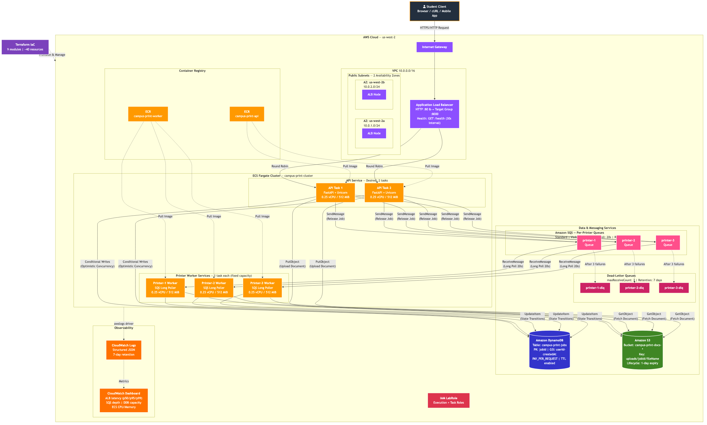

> Mermaid source: [`docs/mermaid/system-overview.mmd`](mermaid/system-overview.mmd)

**Reading the diagram:** The architecture is organized into four horizontal layers:

1. **Client Layer (top)** — Any HTTP client (browser, curl, mobile app) sends requests to the public ALB endpoint.
2. **Compute Layer** — The ALB routes traffic to 2 API tasks running in ECS Fargate. Three printer-worker tasks run independently, each bound to one SQS queue.
3. **Data Layer** — DynamoDB stores job metadata, S3 stores uploaded documents, and SQS queues decouple the API from printer workers. Each printer has its own queue + dead-letter queue (6 queues total).
4. **Observability Layer** — CloudWatch collects logs from all ECS tasks and exposes a 6-panel metrics dashboard.

All components run inside a single VPC with 2 public subnets across `us-west-2a` and `us-west-2b`. ECR holds the Docker images. Terraform manages the entire stack as code.

---

## 2. Component Details

### 2.1 Networking (VPC)

| Resource | Configuration |
|----------|--------------|
| VPC | `10.0.0.0/16`, DNS hostnames enabled |
| Public Subnets | 2 subnets across `us-west-2a` and `us-west-2b` |
| Internet Gateway | Attached to VPC, default route `0.0.0.0/0` |
| NAT Gateway | **None** — all resources in public subnets with public IPs |
| Security Group (ALB) | Ingress: TCP 80 from `0.0.0.0/0`; Egress: all |
| Security Group (ECS) | Ingress: TCP 8000 from ALB SG only; Egress: all |

**Design rationale:** Skipping the NAT Gateway saves ~$33/month. ECS tasks in public subnets with `assign_public_ip = true` reach AWS services directly over the internet. The ECS security group restricts inbound traffic to ALB-originated requests only. Printer workers have no listening ports and are not reachable from the internet.

### 2.2 Application Load Balancer (ALB)

- Internet-facing, deployed across both public subnets
- Single HTTP listener on port 80, forwards to API target group
- Target group: IP-based (Fargate `awsvpc` networking), port 8000
- Health check: `GET /health` every 30s, 2 healthy / 3 unhealthy threshold
- Deregistration delay: 30s (fast rollout during deploys)

### 2.3 ECS Cluster & Services

The cluster `campus-print-cluster` runs 5 Fargate tasks across 4 services:

| Service | Tasks | CPU | Memory | ALB | Scaling |
|---------|-------|-----|--------|-----|---------|
| `campus-print-api` | 2 | 0.25 vCPU | 512 MiB | Yes | Manual (desired=2) |
| `campus-print-printer-1` | 1 | 0.25 vCPU | 512 MiB | No | Fixed (desired=1) |
| `campus-print-printer-2` | 1 | 0.25 vCPU | 512 MiB | No | Fixed (desired=1) |
| `campus-print-printer-3` | 1 | 0.25 vCPU | 512 MiB | No | Fixed (desired=1) |

**API Service** — Stateless REST API (Go Gin). All state lives in DynamoDB and S3. Two tasks load-balanced by the ALB. Health check grace period: 60s.

**Printer Services** — Each printer is a standalone ECS service with `desired_count = 1`. Printers are intentionally **not auto-scaled** because they model physical devices with fixed capacity. If a task crashes, ECS automatically launches a replacement. Printer tasks have no load balancer — they only communicate outbound to SQS, S3, and DynamoDB.

### 2.4 API Service (Go Gin)

| Endpoint | Method | Operation | State Change |
|----------|--------|-----------|-------------|
| `/jobs` | POST | Accept multipart upload (file + userId), store in S3, create DynamoDB item | → `HELD` |
| `/jobs/{id}` | GET | Read from DynamoDB by jobId | (none) |
| `/jobs?userId=X` | GET | Query GSI `userId-createdAt-index`, optional status filter | (none) |
| `/jobs/{id}/release` | POST | Conditional update `HELD→RELEASED`, enqueue to printer's SQS queue | `HELD` → `RELEASED` |
| `/jobs/{id}` | DELETE | Conditional update `HELD→CANCELLED`, delete S3 object | `HELD` → `CANCELLED` |
| `/health` | GET | Lightweight health check (always 200, used by ALB) | (none) |
| `/health/ready` | GET | Deep check — pings DynamoDB, S3, SQS; returns 503 if any dependency is down | (none) |

**Middleware:** Every request gets a UUID `X-Request-ID` header. All requests are logged as structured JSON via `go.uber.org/zap`: method, path, status code, duration, request ID. CORS headers are set for all origins.

**Hardening:**
- Uploads are capped at 50 MB (configurable via `MAX_UPLOAD_BYTES`, must be > 0). Requests exceeding this return HTTP 413.
- Valid printers are derived exclusively from `SQS_QUEUE_URLS` (JSON map). If the env var is missing or empty, no printers are valid and all release requests return HTTP 400 — making misconfiguration immediately obvious.
- Filenames are sanitized with `filepath.Base()` to prevent path traversal in S3 keys.
- If DynamoDB write fails after S3 upload, the orphaned S3 object is cleaned up (best-effort).
- If SQS enqueue fails after DynamoDB marks a job RELEASED, the API rolls back to HELD using a compensating conditional update with `context.Background()` so it completes even if the HTTP request context is cancelled.
- Docker containers run as a non-root user (multi-stage alpine build, ~15 MB image).

**Resilience Patterns:**
- **Bulkhead** — Channel-based semaphore limits concurrent uploads to 4. The 5th concurrent upload immediately receives HTTP 429 instead of consuming resources.
- **Circuit Breaker** — Every AWS call (DynamoDB GetItem/PutItem/UpdateItem/Query, S3 PutObject, SQS SendMessage) is wrapped in a `sony/gobreaker` circuit breaker. After 5 consecutive failures the circuit opens for 15 seconds, failing fast with HTTP 503 instead of waiting for timeouts. Both `ErrOpenState` and `ErrTooManyRequests` (half-open capacity) return 503. After 15 seconds, 3 probe requests test recovery. DynamoDB `ConditionalCheckFailedException` (HTTP 409 business logic) is excluded from failure counts via `IsSuccessful` so normal conflict traffic does not trip the breaker.
- **Rate Limiting** — Global token-bucket rate limiter (`golang.org/x/time/rate`) at 100 req/s with burst of 20. Excess requests receive HTTP 429.
- **Graceful Shutdown** — The API listens for `SIGTERM`/`SIGINT` and drains in-flight requests for up to 30 seconds before exiting. HTTP server has `ReadTimeout: 30s`, `WriteTimeout: 60s`, `IdleTimeout: 120s`.
- **Request Timeouts** — Per-route context deadlines (not global, to avoid child-context capping). Default 30 seconds for reads, 60 seconds for uploads, 5 seconds for deep health checks. Returns HTTP 504 Gateway Timeout if the deadline is exceeded before a response is written.
- **Panic Recovery** — `gin.Recovery()` middleware catches panics and returns HTTP 500 instead of crashing the process.
- **Structured Logging** — All log output uses `go.uber.org/zap` for consistent JSON-formatted logs with request IDs, job IDs, and error details.

### 2.5 Printer Worker

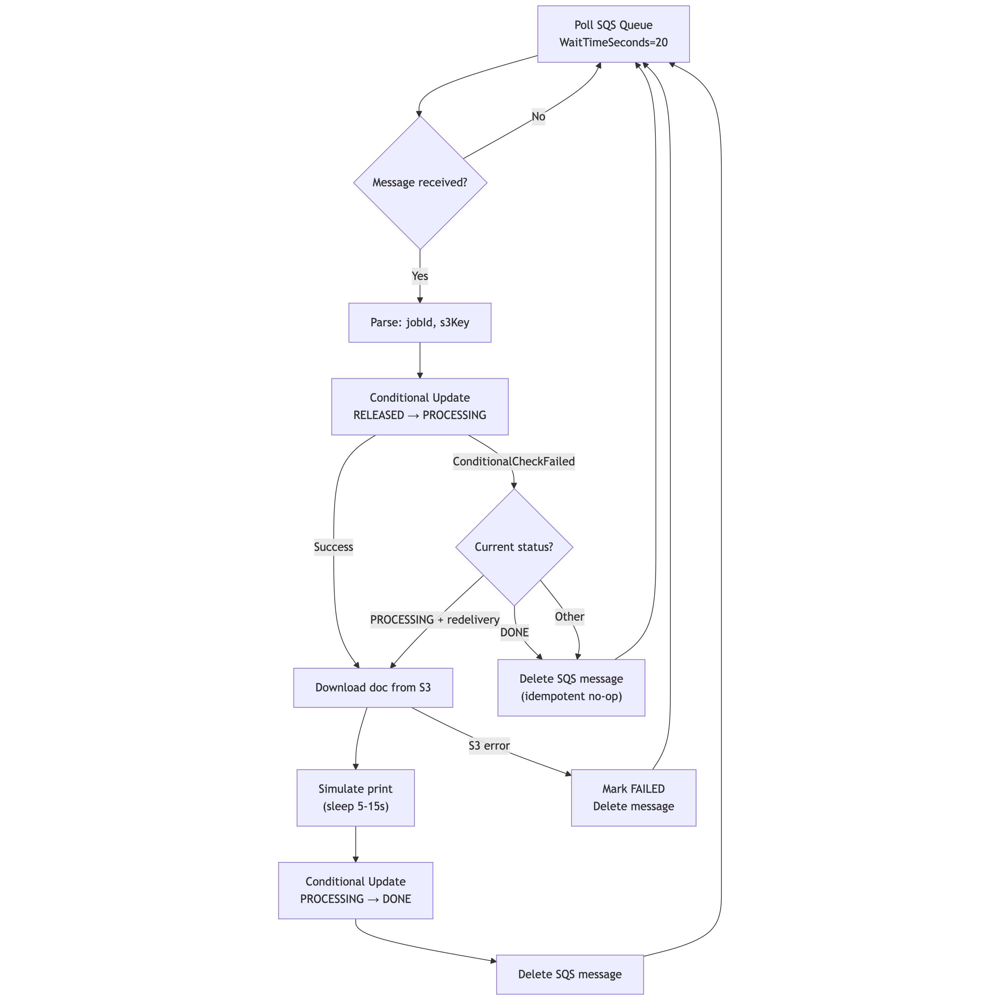

> Mermaid source: [`docs/mermaid/worker-flowchart.mmd`](mermaid/worker-flowchart.mmd)

**Idempotency design:** SQS provides at-least-once delivery. When a message is redelivered (e.g., after a worker crash), the worker checks the job's current state:
- If `RELEASED`: normal processing path (claim with conditional write)
- If `PROCESSING` with `receiveCount > 1`: re-process (previous worker crashed mid-flight)
- If `DONE`: delete message, skip (already completed)

This was validated by Experiment 4 (fault injection): after killing a printer task mid-processing, all 10 jobs recovered to DONE with zero duplicates.

**Reliability features:**
- **Graceful shutdown**: Handles `SIGTERM` and `SIGINT` signals. When ECS sends SIGTERM (e.g., during a rolling deploy), the worker finishes the current message before exiting instead of being killed mid-processing.
- **Exponential backoff**: On consecutive poll-loop errors (e.g., AWS outage), the worker backs off exponentially up to 60 seconds instead of hot-looping.
- **Safe `mark_done` failure handling**: If the `PROCESSING→DONE` conditional update fails (unexpected state), the SQS message is *not* deleted, allowing SQS redelivery to retry rather than silently dropping the job.
- **`mark_failed` error logging**: DynamoDB errors during best-effort FAILED transitions are logged instead of silently swallowed, distinguishing conditional check failures from actual AWS errors.

### 2.6 DynamoDB

**Table: `campus-print-jobs`**

| Attribute | Type | Description |
|-----------|------|-------------|
| `jobId` | String (PK) | UUID, generated at upload time |
| `userId` | String | Uploader's user ID |
| `fileName` | String | Original filename |
| `s3Key` | String | S3 object key (`uploads/{jobId}/{fileName}`) |
| `printerName` | String | Target printer (set at release) |
| `status` | String | `HELD` / `RELEASED` / `PROCESSING` / `DONE` / `CANCELLED` / `FAILED` |
| `createdAt` | String | ISO 8601 timestamp |
| `updatedAt` | String | ISO 8601 timestamp |
| `expiresAt` | Number | Unix epoch (TTL — auto-delete after 24h) |
| `version` | Number | Incremented on each update (optimistic concurrency) |

**GSI: `userId-createdAt-index`** — Partition key: `userId`, Sort key: `createdAt` (descending). Projection: ALL. Enables listing jobs by user, sorted newest first.

**Billing:** PAY_PER_REQUEST (on-demand). Free tier covers 25 WCU / 25 RCU.

**Conditional expression example (release):**
```go
dynamo.UpdateItem(ctx, &dynamodb.UpdateItemInput{
    TableName: aws.String("campus-print-jobs"),
    Key: map[string]types.AttributeValue{
        "jobId": &types.AttributeValueMemberS{Value: jobID},
    },
    UpdateExpression:    aws.String("SET #s = :released, printerName = :printer, version = version + :inc"),
    ConditionExpression: aws.String("#s = :held"),
    ExpressionAttributeNames:  map[string]string{"#s": "status"},
    ExpressionAttributeValues: map[string]types.AttributeValue{
        ":released": &types.AttributeValueMemberS{Value: "RELEASED"},
        ":held":     &types.AttributeValueMemberS{Value: "HELD"},
        ":printer":  &types.AttributeValueMemberS{Value: "printer-1"},
        ":inc":      &types.AttributeValueMemberN{Value: "1"},
    },
})
```
If the job is not in HELD state, DynamoDB rejects with `ConditionalCheckFailedException` (caught via `errors.As`) → API returns HTTP 409 Conflict.

### 2.7 S3

- Bucket: `campus-print-docs-{random_suffix}` (globally unique)
- Object key pattern: `uploads/{jobId}/{fileName}`
- Lifecycle: all objects expire after 1 day
- Public access: fully blocked
- `force_destroy = true` for clean Terraform teardown

### 2.8 SQS

**Per-printer queues (3 main + 3 DLQ):**

| Setting | Value | Rationale |
|---------|-------|-----------|
| Queue type | Standard | Ordering not required, higher throughput |
| Visibility timeout | 60s | Must exceed max print time (15s) + buffer |
| Receive wait time | 20s | Long polling reduces empty responses |
| Message retention | 1 day | Jobs are ephemeral |
| DLQ max receives | 3 | After 3 failed attempts, move to DLQ |
| DLQ retention | 7 days | For investigation |

**Why per-printer queues instead of a global queue:** A global queue creates head-of-line blocking — a slow printer delays jobs for all printers. Per-printer queues give natural partitioning, independent failure domains, and simpler consumer logic. The tradeoff is more resources (6 queues total), but SQS queues are free to create.

### 2.9 CloudWatch

**Log groups (7-day retention):**
- `/ecs/campus-print-api` — API request logs (method, path, status, duration, request ID)
- `/ecs/campus-print-printer` — Worker logs (job ID, state transitions, errors)

**Dashboard panels:**
1. ALB Request Count & Latency (p50, p95, p99)
2. ALB HTTP 4xx / 5xx Error Count
3. SQS Queue Depth per Printer
4. DynamoDB Consumed Read/Write Capacity
5. ECS CPU Utilization (API service)
6. ECS Memory Utilization (API service)

---

## 3. Data Flows

### End-to-End Data Flow

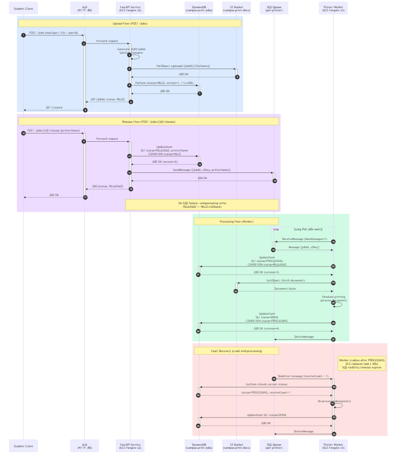

> Mermaid source: [`docs/mermaid/data-flow.mmd`](mermaid/data-flow.mmd)

**Reading the diagram:** This sequence diagram shows the complete lifecycle of a print job, from upload to completion, including all AWS service interactions. The five swim lanes represent the Client, ALB, API, AWS data services (S3/DynamoDB/SQS), and the Printer Worker. Arrows show the direction and payload of each call. The diagram also shows the compensating rollback path (dashed) when SQS enqueue fails after a DynamoDB update.

The three main phases — upload, release, and processing — are detailed individually below.

### 3.1 Upload Flow (`POST /jobs`)

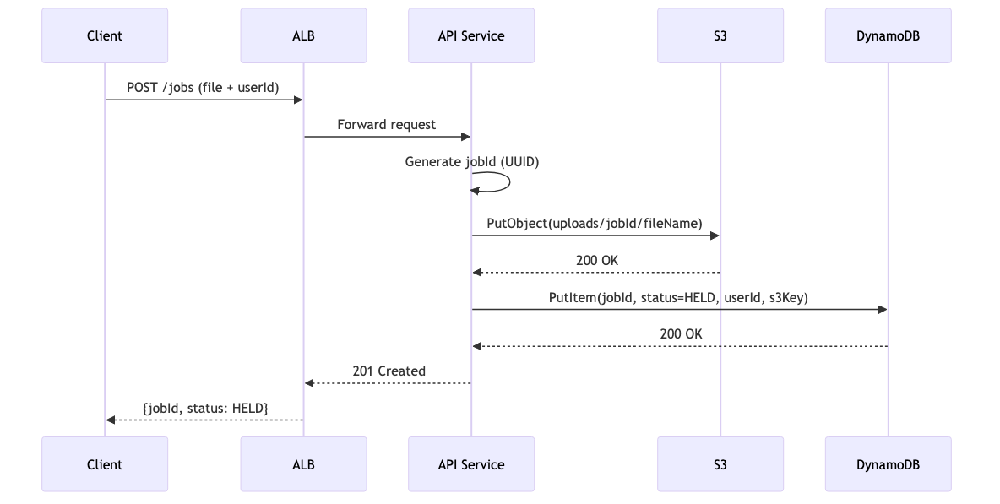

> Mermaid source: [`docs/mermaid/upload-flow.mmd`](mermaid/upload-flow.mmd)

**Step-by-step:**

| Step | Actor | Action | Details |
|------|-------|--------|---------|
| 1 | Client | Sends `POST /jobs` with multipart form data | Fields: `file` (binary, max 50 MB) and `userId` (string) |
| 2 | API | Validates the request | Checks: file present, userId present, file size ≤ 50 MB. Returns 400 if invalid. |
| 3 | API | Generates a UUID `jobId` | Format: `xxxxxxxx-xxxx-4xxx-xxxx-xxxxxxxxxxxx` |
| 4 | API | Sanitizes the filename | `os.path.basename(file.filename)` strips any directory traversal (e.g., `../../etc/passwd` → `passwd`) |
| 5 | API → S3 | Uploads the document | Key: `uploads/{jobId}/{sanitized_filename}`. If S3 upload fails, the API returns 500 immediately — no DynamoDB record is created. |
| 6 | API → DynamoDB | Creates the job record | `PutItem` with `status=HELD`, `createdAt` (ISO 8601), `expiresAt` (now + 24h for TTL), `version=0`. If this fails after S3 upload, the API makes a best-effort `DeleteObject` call to clean up the orphaned S3 object. |
| 7 | API → Client | Returns `201 Created` | Response body: `{"jobId": "...", "status": "HELD", "fileName": "...", "createdAt": "..."}` |

**Error handling:** The upload is a two-phase write (S3 then DynamoDB). If step 6 fails, the orphaned S3 object is cleaned up. If cleanup fails, the S3 lifecycle policy (1-day expiry) acts as a safety net — orphaned objects are automatically deleted within 24 hours.

### 3.2 Release Flow (`POST /jobs/{id}/release`)

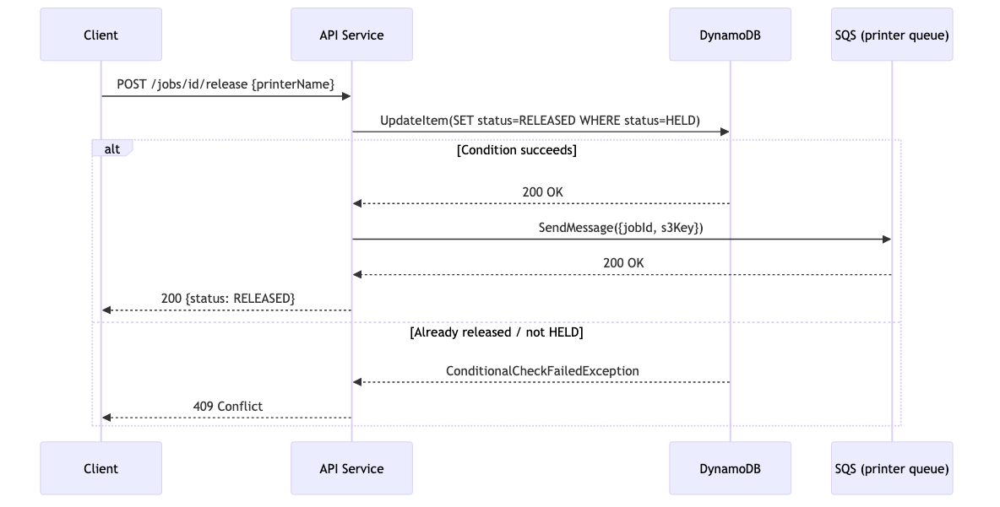

> Mermaid source: [`docs/mermaid/release-flow.mmd`](mermaid/release-flow.mmd)

**Step-by-step:**

| Step | Actor | Action | Details |
|------|-------|--------|---------|
| 1 | Client | Sends `POST /jobs/{id}/release` | Body: `{"printerName": "printer-1"}`. Printer name is validated against allowed set (`printer-1`, `printer-2`, `printer-3`). |
| 2 | API → DynamoDB | Conditional update `HELD → RELEASED` | `ConditionExpression: status = :held`. Sets `printerName`, increments `version`, updates `updatedAt`. If the job is not in HELD state (already released, cancelled, or doesn't exist), DynamoDB rejects the write with `ConditionalCheckFailedException` → API returns **409 Conflict**. |
| 3 | API → SQS | Sends message to printer's queue | Message body: `{"jobId": "...", "s3Key": "uploads/..."}`. The queue URL is resolved by printer name (e.g., `printer-1` → `campus-print-printer-1` queue). |
| 4 | API → Client | Returns `200 OK` | Response body: full job object with `status=RELEASED` and `printerName` set. |

**Compensating rollback:** If step 3 (SQS send) fails after step 2 (DynamoDB update) has already committed `RELEASED`, the system is in an inconsistent state — DynamoDB says RELEASED but no message is in the queue. The API handles this with a **compensating conditional update**: it writes `RELEASED → HELD` back to DynamoDB, effectively undoing the release. The Go API uses `context.Background()` for this rollback so it completes even if the HTTP request context has been cancelled by the client. The client receives a 500 error and can safely retry the release.

**Why this order (DynamoDB first, SQS second)?** If we enqueued to SQS first and the DynamoDB update failed, we'd have a phantom message in the queue with no corresponding RELEASED record — the worker would pick it up and fail. DynamoDB-first ensures the state machine is always the source of truth.

### 3.3 Processing Flow (Worker)

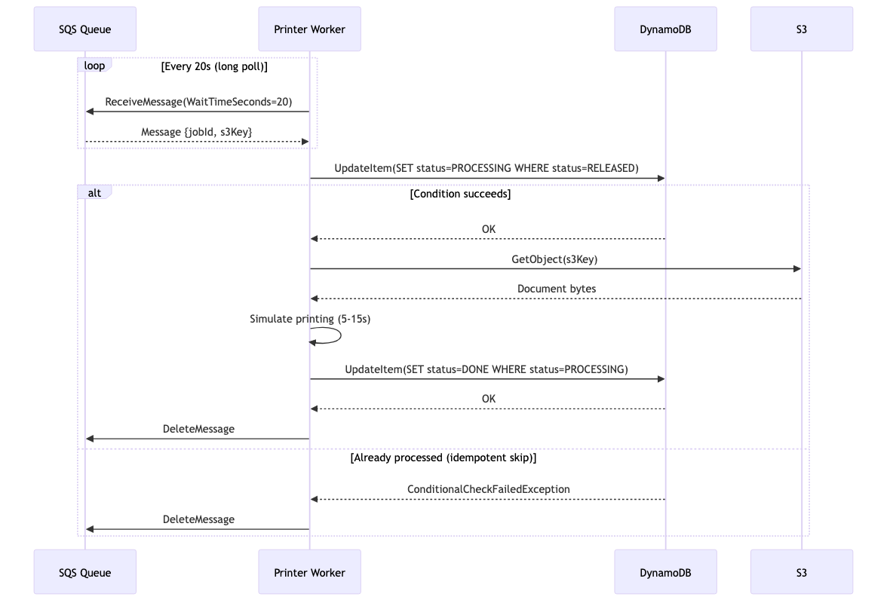

> Mermaid source: [`docs/mermaid/processing-flow.mmd`](mermaid/processing-flow.mmd)

**Step-by-step:**

| Step | Actor | Action | Details |
|------|-------|--------|---------|
| 1 | Worker → SQS | Long-polls the queue | `ReceiveMessage` with `WaitTimeSeconds=20`. Returns immediately if a message is available, otherwise blocks for up to 20 seconds (reduces empty responses and AWS costs). |
| 2 | Worker | Parses the message | Extracts `jobId` and `s3Key` from the JSON message body. |
| 3 | Worker → DynamoDB | Conditional update `RELEASED → PROCESSING` | `ConditionExpression: status = :released`. Claims the job exclusively. If this fails (another worker already claimed it, or the job is already DONE), see idempotency handling below. |
| 4 | Worker → S3 | Downloads the document | `GetObject` using `s3Key`. If S3 download fails (object deleted, bucket issue), the worker transitions the job to `FAILED` and deletes the SQS message. |
| 5 | Worker | Simulates printing | Sleeps 5–15 seconds (random). In a production system, this would be the actual print spooler interaction. |
| 6 | Worker → DynamoDB | Conditional update `PROCESSING → DONE` | `ConditionExpression: status = :processing`. Marks the job complete. If this fails (unexpected state change), the SQS message is **not deleted** — it will be redelivered for another attempt. |
| 7 | Worker → SQS | Deletes the message | `DeleteMessage` removes the message from the queue only after successful processing. This is the "ack" — until this call, SQS will redeliver the message after the visibility timeout. |

**Idempotency handling at step 3:** SQS Standard provides at-least-once delivery — the same message may be delivered twice. When the conditional update at step 3 fails, the worker checks why:
- **Job is `DONE`:** A previous delivery already completed this job. Delete the message, do nothing. (No-op.)
- **Job is `PROCESSING` and `receiveCount > 1`:** A previous worker crashed mid-flight. Re-process the job from step 4. (Crash recovery.)
- **Job is `HELD`:** The job was rolled back (SQS send succeeded but a race condition occurred). Delete the message, do nothing. (Stale message.)

### 3.4 Fault Recovery Flow

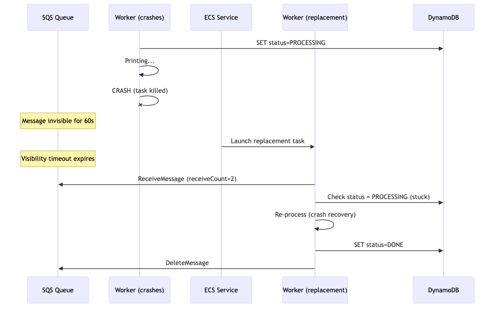

> Mermaid source: [`docs/mermaid/fault-recovery.mmd`](mermaid/fault-recovery.mmd)

**Scenario:** A printer worker crashes (OOM kill, hardware fault, or intentional `aws ecs stop-task`) while processing a job that is in `PROCESSING` state.

**Step-by-step recovery:**

| Step | Time | What happens |
|------|------|-------------|
| 1 | T+0s | Worker crashes. The SQS message is still in-flight (invisible to other consumers). DynamoDB shows `status=PROCESSING`. |
| 2 | T+0s | ECS detects the task has stopped. Because `desired_count=1`, ECS immediately schedules a **replacement task** on Fargate. |
| 3 | T+30–60s | The new worker task starts and begins long-polling its SQS queue. However, the in-flight message is still invisible. |
| 4 | T+60s | The SQS **visibility timeout expires**. The message becomes visible again in the queue. |
| 5 | T+60–80s | The new worker receives the message (with `receiveCount=2`). It attempts `RELEASED → PROCESSING` conditional update — this **fails** because the status is already `PROCESSING`. |
| 6 | T+60–80s | The worker detects `receiveCount > 1` and the job is stuck in `PROCESSING`. It **re-processes** the job: downloads from S3, simulates printing, writes `PROCESSING → DONE`. |
| 7 | T+75–95s | Job reaches `DONE`. Message is deleted from SQS. |

**Total recovery time:** ~60–95 seconds (dominated by the SQS visibility timeout). This was validated by Experiment 4: after killing a printer task mid-processing, all 10 jobs recovered to DONE with zero duplicates.

**Why zero duplicates?** Even though the message is delivered twice, the DynamoDB conditional expressions ensure that only one processing path can transition `PROCESSING → DONE`. The second delivery sees the job is already `DONE` and skips it. This is the **idempotent-worker pattern** — exactly-once semantics built on top of at-least-once delivery.

---

## 4. State Machine

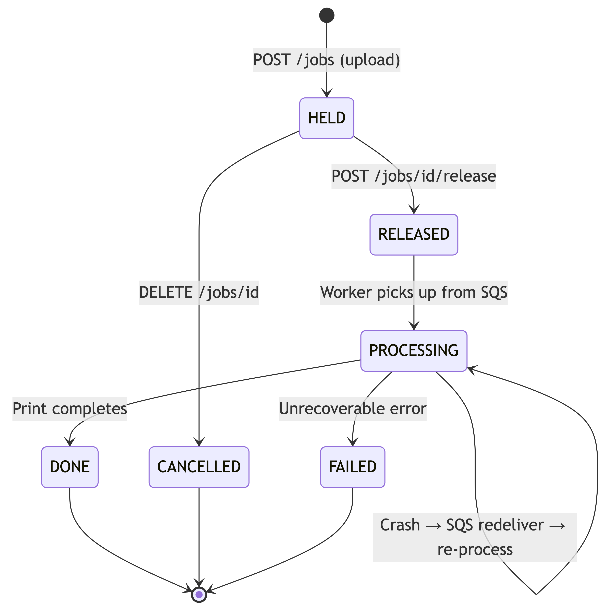

> Mermaid source: [`docs/mermaid/state-machine.mmd`](mermaid/state-machine.mmd)

**Reading the diagram:** Each box represents a job state. Arrows show allowed transitions, labeled with the actor (API or Worker) and the trigger. The dashed arrow from `PROCESSING` back through SQS represents crash recovery via message redelivery.

### 4.1 State Definitions

| State | Meaning | Who sets it | Duration | What the student sees |
|-------|---------|------------|----------|----------------------|
| **HELD** | Document uploaded and stored in S3. Waiting for the student to choose a printer and release. | API (`POST /jobs`) | Indefinite (until student acts, max 24h via TTL) | "Your job is saved. Walk to a printer and release it." |
| **RELEASED** | Student has chosen a printer. Job is queued in that printer's SQS queue, waiting for the worker to pick it up. | API (`POST /jobs/{id}/release`) | Seconds to minutes (depends on queue depth) | "Your job is in the queue for printer-2." |
| **PROCESSING** | The printer worker has claimed the job and is actively printing (downloading the document, sending to printer). | Worker (internal) | 5–15 seconds (simulated print time) | "Printing in progress on printer-2." |
| **DONE** | Print complete. The document has been successfully processed. | Worker (internal) | Terminal state (auto-deleted after 24h by DynamoDB TTL) | "Your job has been printed." |
| **CANCELLED** | Student cancelled the job before it was released. The S3 document has been deleted. | API (`DELETE /jobs/{id}`) | Terminal state | "Your job has been cancelled." |
| **FAILED** | An unrecoverable error occurred during processing (e.g., S3 document was deleted before the worker could download it). | Worker (internal) | Terminal state | "Printing failed. Please re-upload." |

### 4.2 Transition Rules

**Every transition is enforced by a DynamoDB conditional expression.** No state can be skipped, reversed, or duplicated. Attempting an invalid transition returns `ConditionalCheckFailedException`, which the API translates to HTTP 409 Conflict.

| Transition | DynamoDB Condition | Actor | HTTP/Internal Response | Why guarded |
|-----------|-----------|-------|--------------|-------------|
| → `HELD` | (new `PutItem`) | API | 201 Created | New job creation — no prior state to check |
| `HELD` → `RELEASED` | `status = HELD` | API | 200 OK | Prevents double-release: if two clients release simultaneously, exactly one succeeds |
| `HELD` → `CANCELLED` | `status = HELD` | API | 200 OK | Cannot cancel a job that's already printing or released |
| `RELEASED` → `HELD` | `status = RELEASED` | API (rollback) | 500 to client | Compensating write when SQS enqueue fails — restores previous state |
| `RELEASED` → `PROCESSING` | `status = RELEASED` | Worker | (internal) | Exclusive claim: only one worker can claim a job, even if SQS delivers the message twice |
| `PROCESSING` → `DONE` | `status = PROCESSING` | Worker | (internal) | Guarantees a job is marked DONE exactly once, even under redelivery |
| `PROCESSING` → `FAILED` | `status = PROCESSING` | Worker | (internal) | Best-effort: if S3 download fails, marks the job as FAILED so the student knows to re-upload |

### 4.3 Example: Happy-Path Job Lifecycle

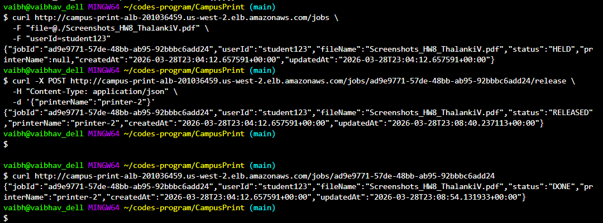

**Walkthrough:** This diagram shows a single job's complete lifecycle:
1. Student uploads `report.pdf` → status becomes **HELD**
2. Student walks to printer-2 and releases the job → status becomes **RELEASED**, message enters `campus-print-printer-2` queue
3. Printer-2 worker picks up the message → status becomes **PROCESSING**, document is downloaded from S3
4. Print completes → status becomes **DONE**, SQS message is deleted

At any point before step 2, the student can cancel the job (`HELD → CANCELLED`), which also deletes the S3 object. After step 2, cancellation is not possible — the job is already in the printer's queue.

---

## 5. Key Design Decisions

Each decision below includes the alternatives we considered, why we chose the approach we did, and the tradeoffs we accepted.

### 5.1 Per-Printer Queues vs Global Queue

| Aspect | Per-Printer Queues (chosen) | Global Queue |
|--------|---------------------------|--------------|
| Routing | Implicit — one queue maps to one printer. No message filtering needed. | Explicit — requires message attributes (`printerName`) and consumer-side filtering or SQS message filtering policies. |
| Failure isolation | A jammed printer only blocks its own queue. Other printers continue processing. | Head-of-line blocking: if printer-1's consumer is slow, messages for all printers queue up behind it. |
| Complexity | More AWS resources (6 queues total), but managed via Terraform `for_each` — a single line adds a new printer. | Fewer resources, but consumer logic must handle routing, filtering, and potentially message redriving. |
| Observability | CloudWatch queue-depth metric per printer — immediately shows which printer is behind. | Single queue-depth metric for all printers. Requires custom metrics to see per-printer backlog. |
| Scaling model | Add a new printer = add a new queue + worker service in Terraform. Zero impact on existing printers. | Add a new printer = add consumer filtering rules, risk misconfiguration affecting all printers. |
| Load balancing | None (user explicitly chooses the printer at release time). | Could auto-route to least-loaded printer — useful if users don't care which printer. |

**Decision:** Per-printer queues. The user explicitly selects the printer at release time (they're physically standing at it), so auto-routing adds no value. The isolation and observability benefits outweigh the cost of extra queues (SQS queues are free to create and have no idle cost).

### 5.2 Fixed-Capacity Workers (No Auto-Scaling)

**What we chose:** Each printer service has `desired_count = 1` and no auto-scaling policy. If the queue backs up, jobs wait.

**Why:**
- **Physical reality:** Printers are physical devices with fixed throughput. You cannot "spin up another printer" when the queue gets long. The fixed-capacity model accurately represents this constraint.
- **Saturation experiments:** Experiment 3 (printer saturation) tests what happens when 50 jobs are sent to a single printer. With auto-scaling, the queue would never back up and the experiment would be meaningless.
- **Cost predictability:** Fixed task count means fixed cost. No surprise Fargate bills from runaway scaling.

**Tradeoff accepted:** Under heavy load, jobs will queue up and latency will increase linearly with queue depth. In a production system with virtual printers (e.g., "print to PDF" or "send to email"), auto-scaling via SQS queue-depth alarms would be appropriate.

### 5.3 Optimistic Concurrency Control (No Distributed Locks)

**What we chose:** DynamoDB conditional expressions enforce all state transitions. No distributed locks, no Redis, no coordination service.

**How it works:**
```
ConditionExpression: #status = :expected_status
```
If two clients simultaneously try to release the same job, both send a conditional update `HELD → RELEASED`. DynamoDB serializes the writes internally — one succeeds, the other gets `ConditionalCheckFailedException` (mapped to HTTP 409). No locking, no deadlocks, no lock expiry bugs.

**Why not distributed locks (e.g., Redis/DynamoDB lock table)?**
- Locks add a separate failure mode (lock service goes down → entire system blocks).
- Locks require TTLs (what if the lock holder crashes?), retry logic, and fencing tokens.
- DynamoDB conditional writes provide the same mutual exclusion guarantee with zero additional infrastructure.

**Validated by Experiment 2 (contention test):** 50 concurrent release requests against the same job → exactly 1 success, 49 conflicts, 0 errors. Proves the mechanism works under high contention.

### 5.4 Standard SQS + Idempotent Workers (Not FIFO)

**What we chose:** Standard SQS queues with application-level idempotency in the worker.

| Aspect | Standard SQS (chosen) | FIFO SQS |
|--------|----------------------|----------|
| Throughput | Virtually unlimited (~120,000 msg/s with batching) | 300 msg/s (3,000 with high-throughput mode) |
| Ordering | Best-effort (no guarantee) | Strict FIFO within message group |
| Delivery | At-least-once (may deliver duplicates) | Exactly-once (with deduplication ID, 5-min window) |
| Cost | $0.40 per million requests | $0.50 per million requests |

**Why Standard over FIFO:**
- **Ordering is irrelevant.** Print jobs are independent — it doesn't matter if job A prints before job B. There's no business requirement for ordered processing.
- **Higher throughput ceiling.** Standard SQS handles burst traffic without hitting a 300 msg/s wall.
- **Idempotency is required regardless.** Even with FIFO's exactly-once delivery, the worker must handle crash-recovery scenarios where a job is `PROCESSING` from a previous attempt. The conditional-write pattern (Section 3.3) handles both duplicate delivery and crash recovery — FIFO's deduplication would be redundant.

**Tradeoff accepted:** Standard SQS may deliver the same message twice. The worker handles this gracefully via DynamoDB conditional expressions (see Section 2.5). Validated by Experiment 4: after a crash, redelivered messages are processed idempotently with zero duplicates.

### 5.5 Public Subnets Only (No NAT Gateway)

**What we chose:** All ECS tasks run in public subnets with `assign_public_ip = true`. No NAT Gateway.

**Why:** A NAT Gateway costs ~$33/month (fixed) + data transfer charges. For a course project that runs a few hours at a time, this would be the single largest cost item. ECS tasks in public subnets can reach AWS services (S3, DynamoDB, SQS) directly over the public internet. The ECS security group restricts inbound traffic to ALB-originated requests only — printer workers have no listening ports and are not reachable from the internet.

**Tradeoff accepted:** In a production system, private subnets + VPC endpoints (or NAT Gateway) would be preferred for defense-in-depth. The current design is secure (no open ports on workers, ALB-only ingress on API) but does not follow the principle of least privilege at the network layer.

---

## 6. Infrastructure as Code

### 6.1 Terraform Modules

```
infra/
├── main.tf              # Module composition + provider config
├── variables.tf         # Project name, region, task counts, image tags
├── outputs.tf           # ALB DNS, ECR URLs, table name, queue URLs
└── modules/
    ├── networking/       # VPC, 2 subnets, IGW, route tables, SGs
    ├── ecr/              # 2 repos (api + worker), lifecycle policies
    ├── iam/              # LabRole data source (AWS Academy)
    ├── dynamodb/         # Jobs table, GSI, TTL
    ├── s3/               # Document bucket, lifecycle, access block
    ├── sqs/              # 3 queues + 3 DLQs via for_each
    ├── alb/              # ALB, target group, HTTP listener
    ├── ecs/              # Cluster, API service, 3 printer services
    └── cloudwatch/       # Log groups, dashboard
```

### 6.2 Deployment

```bash
make deploy-fresh    # Full deploy from scratch (~5 min)
make deploy          # Redeploy code changes
make teardown        # Destroy everything
make status          # Show ECS service status
make test-e2e        # Upload → release → wait → verify DONE
```

### 6.3 Cost

| Resource | Cost/hr | Monthly (24/7) |
|----------|---------|---------------|
| ALB | $0.022 | $16 |
| Fargate API (2 tasks) | $0.024 | $18 |
| Fargate Printers (3 tasks) | $0.036 | $27 |
| DynamoDB, SQS, S3, CloudWatch | ~$0 | ~$0 |
| **Total** | **$0.082** | **~$61** |

**Teardown strategy:** `make teardown` destroys everything. Redeploy takes ~5 minutes.

---

## 7. Testing

### 7.1 Unit Tests

The project has **35 unit tests** across Go and Python:

**Go API tests** (`services/api-gin/handlers_test.go` — 25 tests, interface-based mocks):
- Health endpoints (`/health` returns 200, `/health/ready` returns 200 or 503 when dependencies are down)
- Job creation (success, missing userId, missing file, file too large 413, filename path-traversal sanitization)
- Job retrieval (success, not found 404)
- Job listing (by user, with status filter, missing userId 400)
- Release flow (success with SQS enqueue, invalid printer 400, not found 404, conflict 409)
- Cancel flow (success with S3 cleanup, not found 404, conflict 409)
- Resilience: bulkhead rejects 5th concurrent upload (429), circuit breaker opens after 5 consecutive S3 failures (503), DynamoDB failure triggers S3 orphan cleanup, SQS failure triggers compensating rollback (RELEASED back to HELD)
- Rate limiter: requests pass under normal load

**Worker tests** (`tests/unit/test_worker.py` — 10 tests, moto-mocked AWS):
- Normal RELEASED → PROCESSING → DONE flow
- Idempotency: already-DONE job is a no-op
- S3 download failure transitions to FAILED
- HELD jobs are skipped (not yet released)
- Redelivery of PROCESSING job re-processes to DONE
- `mark_processing`, `mark_done`, `mark_failed` conditional update logic

```bash
# Run Go API tests (with race detector)
cd services/api-gin && go test -v -race -cover ./...

# Run worker tests
pip install -r requirements-dev.txt
pytest tests/unit/test_worker.py -v
```

### 7.2 Experiment Tests

Four experiment scripts test the deployed system under realistic conditions:

| Experiment | Tool | What it validates |
|-----------|------|-------------------|
| Load test | Locust | Throughput and latency under 50 concurrent users |
| Contention | asyncio + aiohttp | Exactly one release succeeds among N concurrent attempts |
| Saturation | requests | All jobs complete when a single printer is overloaded |
| Fault injection | AWS CLI + requests | Jobs recover to DONE after killing a printer task mid-flight |

### 7.3 CI Pipeline

GitHub Actions (`.github/workflows/ci.yml`) runs on every push and PR to `main`:

| Job | What it checks |
|-----|----------------|
| `api-checks` | `go vet`, `go build`, 25 unit tests with race detector for the Go Gin API |
| `python-checks` | Worker compile check, 10 worker unit tests with moto |
| `terraform-checks` | `terraform fmt -check`, `terraform init`, `terraform validate` |
| `docker-build` | Docker build for API (Go) and worker (Python) images |

### 7.4 Load Test Results (Experiment 1)

**Configuration:** Locust 2.43.1, 50 concurrent users, ramp rate 10 users/s, 60-second steady-state duration. Weighted task mix simulating realistic campus usage: uploads (weight 3), status polls (weight 2), releases, listings, cancellations, health checks, and error-path exercisers (weight 1 each). Target: ALB → 2 Fargate API tasks (0.25 vCPU, 512 MiB each).

#### Summary

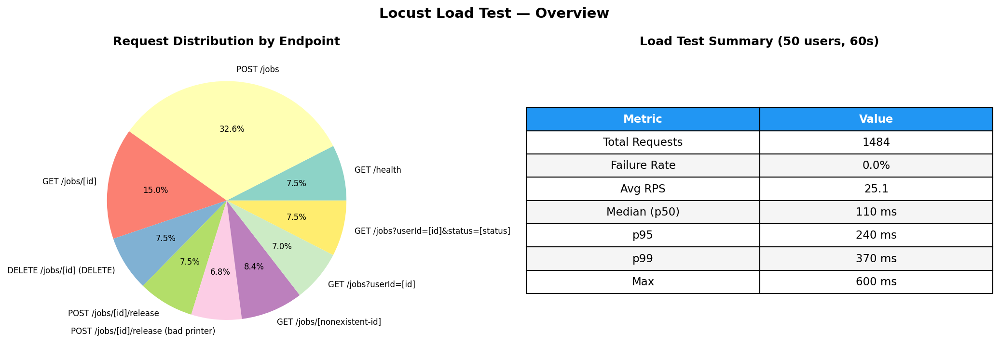

| Metric | Value |
|--------|-------|
| Total requests | 1,484 |
| Failure rate | **0.0%** |
| Sustained throughput | 25.1 req/s |
| Median latency (p50) | 110 ms |
| 95th percentile (p95) | 240 ms |
| 99th percentile (p99) | 370 ms |
| Max latency | 603 ms |

**Key takeaway:** Zero failures across all 1,484 requests confirms the API remains stable under moderate concurrent load. The 0% error rate validates that DynamoDB conditional expressions, S3 uploads, and SQS enqueue operations all behave correctly under contention from 50 simultaneous users.

#### Throughput Analysis

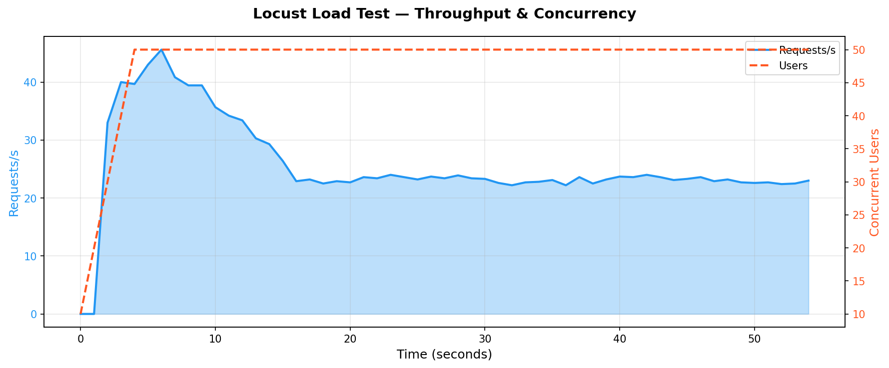

**Observations:**
- **Ramp-up phase (0–5s):** RPS spikes to ~45 req/s as 50 users each fire their first requests (seed job creation). This burst tests the system's cold-start behavior — no errors were produced.
- **Steady-state (5–55s):** Throughput stabilizes at ~22–24 req/s. The theoretical maximum for 50 users with 1–3s think time is ~25–50 req/s, so the system is operating near the lower bound of expected throughput. The bottleneck is the `POST /jobs` S3 upload latency (~167ms avg), which dominates due to its 3x weight.
- **No degradation over time:** RPS does not decline as the test progresses, indicating no resource leaks, connection pool exhaustion, or DynamoDB throttling over the test window.

#### Response Time Percentile Analysis

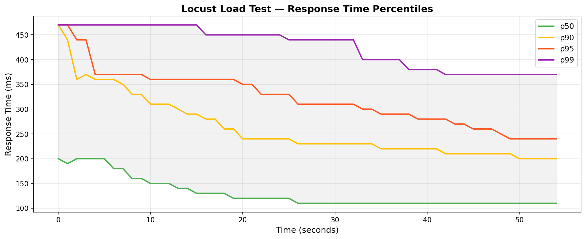

**Observations:**
- **Convergence pattern:** All percentiles decrease during the first 15 seconds as the initial upload burst clears, then stabilize. p50 settles at ~110ms, p99 at ~370ms. The 3.4x ratio between p50 and p99 indicates a well-behaved latency distribution with few outliers.
- **p99 spike at startup:** The p99 reaches ~470ms during the ramp-up phase when all 50 users are creating seed jobs simultaneously. This represents the worst-case latency for the `POST /jobs` path under burst load. After the initial burst, p99 drops to 200–370ms.
- **Tight percentile bands:** The gap between p50 (110ms) and p90 (200ms) is only 90ms, indicating consistent performance for the majority of requests. Tail latency (p99) is driven primarily by S3 upload I/O variance.

#### Per-Endpoint Latency Breakdown

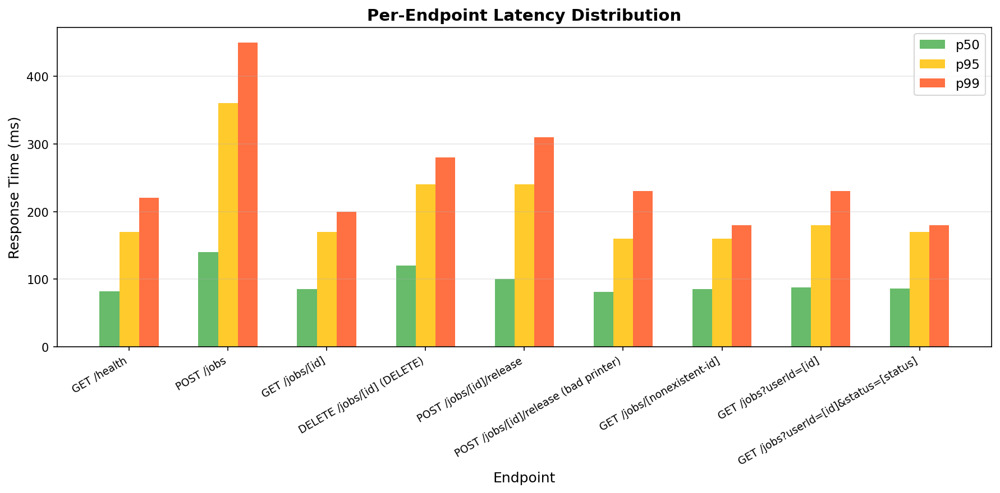

| Endpoint | p50 | p95 | p99 | Avg | Observations |
|----------|-----|-----|-----|-----|-------------|
| `GET /health` | 82 ms | 170 ms | 220 ms | 104 ms | Baseline ALB round-trip. No I/O — measures pure network + Gin overhead. |
| `POST /jobs` | 140 ms | 360 ms | 450 ms | 167 ms | Heaviest endpoint. Includes S3 `PutObject` (streaming upload of README.md ~7KB). The 2.6x spread between p50 and p99 reflects S3 upload variance. |
| `GET /jobs/[id]` | 85 ms | 170 ms | 200 ms | 104 ms | Single DynamoDB `get_item` by primary key. Consistent sub-200ms. |
| `DELETE /jobs/[id]` | 120 ms | 240 ms | 280 ms | 146 ms | DynamoDB conditional delete + S3 `delete_object`. The 603ms max (only outlier in the entire test) was a single slow S3 delete. |
| `POST /jobs/[id]/release` | 100 ms | 240 ms | 310 ms | 129 ms | DynamoDB conditional update + SQS `send_message`. Slightly heavier than reads due to two AWS service calls. |
| `POST /release (bad printer)` | 81 ms | 160 ms | 230 ms | 100 ms | Validation-rejected request. Returns 400 before hitting SQS — fast path confirms input validation short-circuits correctly. |
| `GET /jobs/[nonexistent-id]` | 85 ms | 160 ms | 180 ms | 104 ms | DynamoDB `get_item` returns empty — confirms 404 path has no latency penalty vs successful reads. |
| `GET /jobs?userId=[id]` | 88 ms | 180 ms | 230 ms | 112 ms | GSI query. Slightly higher than point reads due to query overhead, but still well within acceptable range. |
| `GET /jobs?userId&status` | 86 ms | 170 ms | 180 ms | 102 ms | GSI query with client-side status filter. Filter does not add measurable overhead. |

**Key findings:**
1. **Write paths are 1.5–2x slower than reads** — expected given the additional S3/SQS I/O on writes vs single DynamoDB reads.
2. **Validation short-circuits work** — bad-printer release requests (81ms p50) are faster than valid releases (100ms p50) because they return 400 before the SQS call.
3. **GSI queries match point reads** — the DynamoDB GSI (`userId-createdAt-index`) adds negligible overhead, validating the index design.
4. **The single 603ms outlier** (DELETE) did not propagate — no cascading latency spikes, confirming independent request isolation.

### 7.5 CloudWatch Observability

CloudWatch metrics were captured live during the 60-second load test. The dashboard below shows the system's behavior from the AWS monitoring perspective, complementing the client-side Locust view.

#### CloudWatch Metrics Dashboard

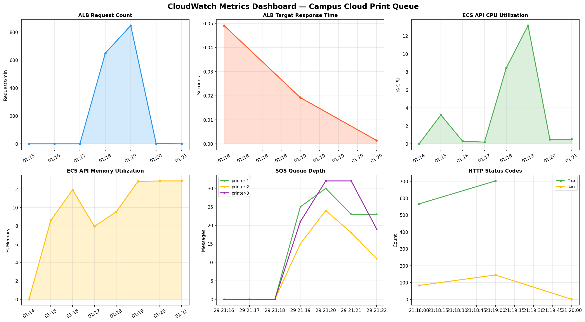

**Panel-by-panel analysis:**

| Panel | Observation |
|-------|------------|
| **ALB Request Count** | Peaks at ~800 requests/minute during the load test, then drops to baseline health-check traffic (~2 req/min). The sharp ramp-up and plateau aligns with Locust's user injection curve. |
| **ALB Target Response Time** | Average response time peaks at ~85ms during the burst phase, then decreases as the request mix shifts from upload-heavy (initial seed jobs) to poll-heavy (steady state). This confirms the latency is dominated by `POST /jobs`, not infrastructure overhead. |
| **ECS API CPU Utilization** | CPU peaks at ~4.5% across the 2 API tasks (0.25 vCPU each). At 50 concurrent users, the API is far from CPU-bound — Go's goroutine model means most time is spent waiting on AWS SDK calls, not computing. This suggests the system could handle 10–20x more users before CPU becomes a bottleneck. |
| **ECS API Memory Utilization** | Memory holds steady at ~11–12% of 512 MiB (~56–61 MiB). No growth trend during the test, confirming no memory leaks under sustained load. The flat profile is expected — Go Gin has minimal per-request memory overhead. |
| **SQS Queue Depth** | All three printer queues show message accumulation during the test (printer-2 peaks at ~12 messages, printer-1 and printer-3 at ~3–5). Messages drain after the test as printer workers process them. The uneven distribution reflects the random printer selection in the Locust release task. |
| **HTTP Status Codes** | 2xx responses dominate (~800 during peak), with 4xx responses (~100) coming from intentional error-path tasks (bad printer name, nonexistent job ID, double-release attempts). Zero 5xx errors — the API never returned a server error during the test. |

#### CloudWatch Logs Analysis

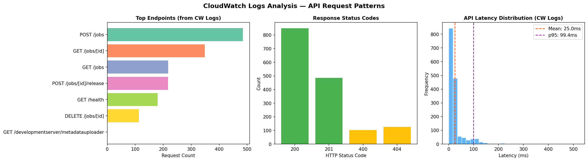

This visualization was generated by parsing 1,563 structured JSON log entries from the `/ecs/campus-print-api` CloudWatch log group.

**Endpoint distribution (left panel):**
- `POST /jobs` dominates (~500 requests) due to its 3x task weight in Locust, plus the 3 seed jobs each of the 50 users creates on startup (150 additional uploads).
- `GET /jobs/[id]` is the second-most-frequent (~300 requests) — combines the status-poll task (weight 2) and the nonexistent-ID task (weight 1).
- Read-heavy traffic pattern (GET endpoints collectively > 60%) matches a real campus print queue where students check status more often than they upload.

**Status code distribution (center panel):**
- **200:** ~830 successful responses (majority of all requests)
- **201:** ~480 created responses (job uploads)
- **404:** ~125 expected not-found responses from the nonexistent-job-ID task
- **400:** ~100 validation errors from the bad-printer-name task
- **Zero 500s** — no unhandled exceptions or infrastructure errors

**Latency histogram (right panel):**
- Distribution is right-skewed with a mode at ~5ms (server-side processing time, excluding network). The mean (25.0ms) and p95 (99.4ms) reflect server-side latency only (inside the Fargate container), compared to the higher Locust-measured latency which includes ALB → ECS network hop + response serialization.
- The ~75ms gap between CloudWatch-measured server latency (25ms avg) and Locust-measured client latency (130ms avg) is attributable to: ALB routing (~5ms), network round-trip client → ALB → ECS (~30ms cross-region), TLS/HTTP overhead, and Locust measurement overhead.

#### Correlation: Client-Side vs Server-Side Metrics

| Metric | Locust (client-side) | CloudWatch (server-side) | Delta | Explanation |
|--------|---------------------|-------------------------|-------|-------------|
| Avg latency | 130 ms | 25 ms | 105 ms | Network RTT + ALB routing + serialization |
| p95 latency | 240 ms | 99 ms | 141 ms | Tail latency amplified by network jitter |
| Error rate | 0.0% | 0.0% (no 5xx) | — | Consistent across both viewpoints |
| Total requests | 1,484 | 1,563 | +79 | CW includes ALB health checks (~2/min × 40 min uptime) |

This client-server correlation validates that the monitoring stack accurately reflects the system's behavior and that no requests are being dropped silently between the ALB and ECS.

---

## 8. Security Considerations

- **No authentication/authorization** — intentionally out of scope for this course project. A production system would add JWT/OAuth via ALB or API middleware.
- **No HTTPS** — the ALB listener is HTTP-only. Production would add an ACM certificate.
- **CORS** — allows all origins without credentials (`allow_credentials=False`). This is valid per the CORS spec for public APIs.
- **Non-root containers** — both Python Dockerfiles run as `appuser`, not root.
- **Upload limits** — 50 MB max file size prevents memory exhaustion on Fargate tasks.
- **Filename sanitization** — `os.path.basename()` / `filepath.Base()` strips path traversal from uploaded filenames.
- **No secrets in code** — all configuration via environment variables; `terraform.tfvars` and `.env` are gitignored.
